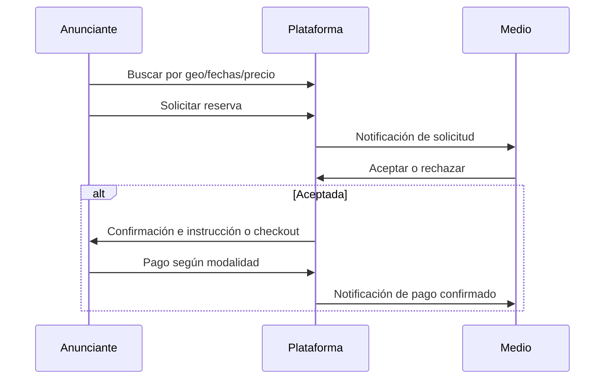

# Alcance MVP — Direct Planning

Documento de alcance para la primera iteración del producto. Las **decisiones confirmadas** deben actualizar este archivo; las marcadas como **pendientes** requieren validación con negocio y asesoría legal/contable.

---

## 1. Objetivo del MVP

Permitir que un **anunciante** descubra inventario **OOH digital** y **medios online** (catálogo inicial), solicite una **reserva** con fechas y ubicación, y complete el flujo hasta **confirmación** y **pago** (o variante manual documentada abajo), con **registro** de anunciantes y **medios/proveedores**.

---

## 2. Mercado piloto (propuesta por defecto)

| Tema | Propuesta | Pendiente de confirmación |
|------|-----------|---------------------------|
| **Geografía** | Argentina, foco **CABA y GBA** (coincide con la red de proveedores listada) | ¿Incluir interior en el mismo MVP o fase 1.1? |
| **Idioma UI** | Español (Argentina) | ¿Inglés opcional para demos? |
| **Moneda** | **ARS** para visualización de precios; acuerdos contractuales según entidad | ¿USD para ciertos contratos? |
| **Zona horaria** | America/Argentina/Buenos_Aires | — |

**Justificación:** El listado de proveedores OOH ya segmenta CABA-GBA e interior; acotar el piloto reduce complejidad operativa y de datos geográficos.

---

## 3. Usuarios y caras del marketplace

| Rol | Incluido en MVP | Notas |
|-----|-----------------|-------|
| **Anunciante** | Sí | Registro, búsqueda, carrito/solicitud de reserva, pago o instrucción de pago |
| **Medio / proveedor** | Sí | Registro, alta y edición de inventario (unidades publicitarias), disponibilidad, aceptación/rechazo de reservas |
| **Administrador plataforma** | Sí (mínimo) | Moderación básica, soporte, parametrización de comisiones (si aplica), visibilidad de transacciones |
| **Agencia / tercero** | No en MVP | Posible roadmap; no bloquea el flujo directo anunciante–medio |

---

## 4. Journey mínimo cerrado (objetivo)

### 4.1 Automático vs manual (propuesta)

| Paso | Modo recomendado MVP | Alternativa manual si se acota tiempo |
|------|----------------------|--------------------------------------|
| Registro y KYC ligero | Automático en producto | Revisión manual por admin para altas de medio |
| Carga de inventario | Panel del medio + importación CSV opcional | Equipo interno carga datos iniciales para beta |
| Reserva | Estados en plataforma (pendiente / aceptada / rechazada) | Email fuera de plataforma solo en beta muy temprana |
| Contrato | Plantilla PDF descargable + aceptación de términos | Firma externa (no integrar DocuSign en MVP) |
| Facturación | Ver [02-facturacion-pagos-comisiones.md](./02-facturacion-pagos-comisiones.md) | Facturación 100% fuera de la plataforma en piloto |
| Pago | Pasarela integrada **o** marcado “pendiente de acreditación” según decisión legal | Transferencia con comprobante subido |

**Regla de oro:** Un solo flujo debe estar **cerrado y medible** en la beta (aunque sea “reserva + pago manual verificado por admin”).

---

## 5. Módulo “digital / online” en el MVP

Opciones (elegir **una** como núcleo del MVP):

1. **Catálogo + lead:** inventario “digital” como paquetes (ej. display en sitios partners) con precio referencial y **contacto o solicitud de propuesta** — sin integración con Meta/Google.
2. **Solo OOH + placeholder digital:** prioridad total a OOH; el módulo digital es **informativo** (landing de servicios).

**Propuesta por defecto:** **(1)** — desacopla el MVP de APIs de grandes plataformas y reduce riesgo técnico y de compliance.

---

## 6. Fuera de alcance MVP (explícito)

- Integración programática con Meta Ads / Google Ads.
- TV, radio y prensa con workflow complejo (Fase 2 del business plan).
- App nativa iOS/Android.
- Motor de recomendación con ML / IA más allá de reglas simples (filtros, ordenamiento).
- Internacionalización multi-país y multi-moneda compleja.

---

## 7. KPIs sugeridos para la beta

- Número de **medios activos** con inventario publicado.
- Número de **solicitudes de reserva** y tasa de **aceptación** por el medio.
- **Ticket medio** y tiempo medio de **respuesta** del medio.
- Tasa de abandono en el paso de pago (si hay checkout integrado).

---

## 8. Checklist de confirmación (negocio)

- [ ] Mercado piloto y moneda definitivos.
- [ ] Flujo de pago: integrado vs manual para la primera beta cerrada.
- [ ] Definición del módulo “digital” (catálogo vs solo OOH).
- [ ] Responsable de carga inicial de inventario (equipo vs medios).
