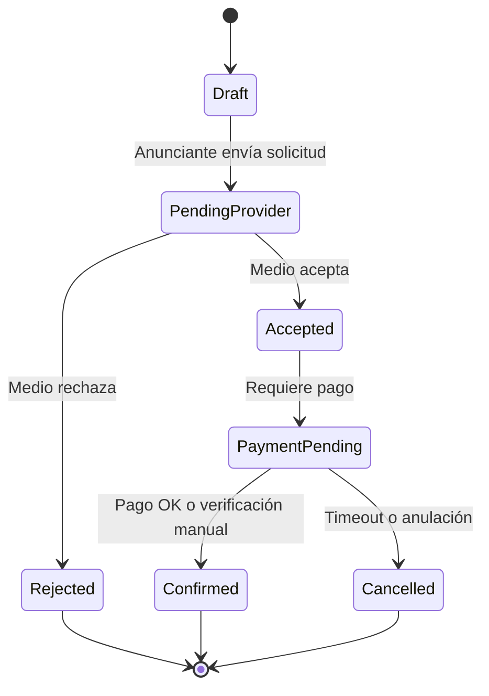

# Modelo de inventario OOH — MVP

Define la **unidad mínima vendible**, el **calendario de disponibilidad**, **precios** y **reglas de reserva** para el módulo OOH en la primera versión del producto.

---

## 1. Conceptos

| Concepto | Definición |
|----------|------------|
| **Proveedor / Medio** | Empresa que opera espacios publicitarios; puede tener muchas ubicaciones. |
| **Ubicación** | Punto geográfico (dirección, barrio, ciudad, coordenadas opcionales). |
| **Unidad de inventario (SKU)** | Lo que el anunciante **reserva**: una cara, pantalla, valla, paquete de caras, etc. |
| **Slot de calendario** | Bloque de tiempo en el que una unidad está disponible u ocupada. |

---

## 2. Unidad mínima vendible (propuesta)

Para no fragmentar el MVP, se recomienda una **única abstracción** en el modelo de datos:

**`InventoryUnit`** — representa un activo reservable con atributos:

| Atributo | Obligatorio MVP | Notas |
|----------|-----------------|-------|
| `name` | Sí | Ej. “Pantalla LED Av. Corrientes y Florida” |
| `format` | Sí | Enum: `digital_ooh`, `static_ooh` (estático puede ser fase 1.1) |
| `location` | Sí | Ciudad, barrio, dirección aproximada; país = AR |
| `geo` | Recomendado | Lat/lng para mapa; si no hay mapa en MVP, búsqueda por texto |
| `base_price` | Sí | Precio de referencia en ARS |
| `price_model` | Sí | Enum: `fixed_list`, `negotiable`, `package` |
| `minimal_booking_duration` | Sí | Ej. 1 día, 1 semana, 2 semanas |
| `provider_id` | Sí | FK al medio |
| `metadata` | Opcional | Tamaño m, tráfico estimado, foto URL |

**Paquetes:** varias unidades pueden agruparse en un **“package”** con precio único (segunda iteración si no entra en MVP).

---

## 3. Calendario y disponibilidad

### 3.1 Granularidad

| Opción | Uso | Complejidad |
|--------|-----|-------------|
| **Día** | Pantallas digitales con rotación diaria | Media |
| **Semana** | Vallas y formatos clásicos | Baja-Media |

**Propuesta MVP:** granularidad **semana** como default; permitir **día** solo para `digital_ooh` si el negocio lo exige.

### 3.2 Estados por slot (por unidad + periodo)

- `available`
- `held` (opcional: hold corto durante checkout)
- `reserved_pending` (solicitud al medio)
- `reserved_confirmed`
- `blocked` (mantenimiento, uso interno del medio)

### 3.3 Solapamientos

- Una misma unidad no puede tener dos reservas **confirmadas** en el mismo rango de fechas.
- Regla de **no solapamiento** aplicada en servidor (validación de negocio).

---

## 4. Precio y comisión

- **Lista fija:** el precio mostrado es el base; la comisión de plataforma se calcula según [02-facturacion-pagos-comisiones.md](./02-facturacion-pagos-comisiones.md) y puede mostrarse desglosada o incluida según decisión de UX.
- **Negociable:** el anunciante envía **oferta** o **rango**; el medio acepta o contraoferta (flujo más complejo — **post-MVP** o versión simplificada: campo “consultar” sin precio final en plataforma).

**Propuesta MVP:** priorizar **precio fijo lista** + opcional “consultar” que genera lead sin compromiso de calendario.

---

## 5. Ciclo de reserva

| Regla | Propuesta MVP |
|-------|-----------------|
| SLA respuesta medio | 48–72 h hábiles (configurable, notificación por email) |
| Caducidad de solicitud | Auto-cancelación si no hay respuesta (opcional) |
| Cancelación post-confirmación | Política mínima: no reembolsable / parcial según términos (definir legal) |

---

## 6. Digital “online” (catálogo)

Unidades de tipo `digital_package` con:

- Descripción, audiencia estimada, precio desde / CPM referencial.
- Sin calendario de caras físicas; puede usarse **“disponibilidad consultar”** o ventana genérica.

---

## 7. Importación y carga de datos

| Método | MVP |
|--------|-----|
| Formulario web por el medio | Sí |
| CSV import (plantilla fija) | Recomendado para onboarding de lista de proveedores |
| API pública | No |

---

## 8. Pendientes de confirmación (producto)

- [ ] Granularidad definitiva: día vs semana para OOH digital.
- [ ] ¿Incluir formato estático en MVP o solo digital?
- [ ] Mapa interactivo vs solo filtros por texto (zona, ciudad).
- [ ] Política de cancelación y reembolso unificada en Términos.
