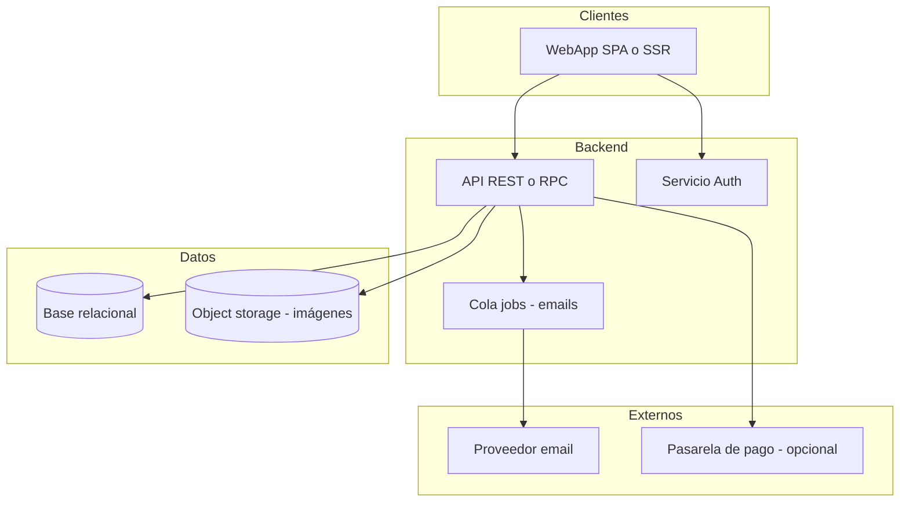

# Arquitectura de alto nivel — MVP NextPlanning

Vista objetivo para la primera implementación técnica. **No prescribe** framework concreto; el equipo puede mapear a Next.js, Laravel, etc.

---

## 1. Diagrama lógico

---

## 2. Componentes

| Componente | Responsabilidad |
|------------|-----------------|
| **WebApp** | UI anunciante, medio y admin; llamadas autenticadas a API |
| **API** | Reglas de negocio, validación de reservas, disponibilidad, comisiones |
| **Auth** | Sesiones/JWT/OAuth; mapa usuario ↔ rol |
| **BD** | Usuarios, perfiles, unidades de inventario, disponibilidad, reservas, auditoría |
| **Object storage** | Imágenes de unidades (URLs firmadas o públicas según política) |
| **Cola + workers** | Envío asíncrono de emails, webhooks de pago |
| **Email** | Transaccional (SendGrid, Resend, SES, etc.) |
| **Pasarela** | Según decisión en [02-facturacion-pagos-comisiones.md](./02-facturacion-pagos-comisiones.md) |

---

## 3. Modelo de datos (entidades principales)

- **User** — credenciales, rol.
- **AdvertiserProfile** / **ProviderProfile** — 1:1 con User según rol.
- **InventoryUnit** — según [03-modelo-inventario-ooh.md](./03-modelo-inventario-ooh.md).
- **AvailabilityBlock** — unidad + rango fecha inicio/fin + estado.
- **Reservation** — anunciante, unidad, rango, estado, montos, timestamps, auditoría.

Índices recomendados: búsqueda por ubicación (texto o geo), fechas de disponibilidad, `provider_id`, estado de reserva.

---

## 4. API (superficie mínima)

| Área | Endpoints conceptuales |
|------|------------------------|
| Auth | registro, login, refresh, logout |
| Perfiles | GET/PATCH perfil según rol |
| Inventario | CRUD unidades (provider); GET público filtrado para búsqueda |
| Disponibilidad | PUT rangos por unidad |
| Reservas | POST solicitud; PATCH aceptar/rechazar (provider); GET listados |
| Admin | listados y PATCH de estado / pago |
| Webhooks | POST pago (si aplica) |

Todas las operaciones mutables validan **rol** y **propiedad** (ej. solo el dueño de la unidad acepta la reserva).

---

## 5. Seguridad

- HTTPS obligatorio en producción.
- Contraseñas con hash fuerte (argon2/bcrypt).
- Rate limiting en login y creación de reservas.
- Sanitización de inputs; IDs opacos o UUID en URLs si se desea.
- CORS restringido al dominio front.

---

## 6. Entornos y despliegue

- **dev**, **staging**, **prod** con variables de entorno para secretos.
- Migraciones versionadas de esquema BD.
- Backups automáticos de BD en prod.

---

## 7. Próximos pasos técnicos (fuera de este documento)

- Elegir stack y crear repositorio con CI (lint, test, deploy).
- Definir proveedor de hosting (Vercel, Fly, AWS, etc.) acorde a región Argentina/latencia.

---

## Referencias

- PRD: [04-prd-mvp.md](./04-prd-mvp.md)  
- Alcance: [01-alcance-mvp.md](./01-alcance-mvp.md)
