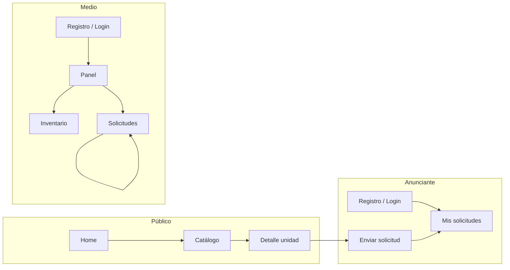

# Flujos del MVP (NextPlanning)

Estado del producto: **modelo de cobro C** — la plataforma gestiona el **match** (descubrimiento, solicitud y estados de reserva); **pago y facturación** quedan fuera de la app en esta versión.

---

## 1. Visitante (sin cuenta)

1. Entra al **home** (`/`).
2. Va al **catálogo** (`/explorar`), puede **filtrar** por texto/ubicación, medio, rango de fechas (disponibilidad aproximada) y precio máximo, y elegir vista **lista**, **mapa** o **ambos**. Los puntos en el mapa requieren que el medio haya cargado **coordenadas** en la unidad.
3. Abre el detalle de una unidad (`/explorar/[id]`).
4. Si quiere **reservar**, necesita cuenta de **anunciante** (la UI muestra enlace a registro / login).

---

## 2. Anunciante

1. **Registro** (`/register`) → elige tipo **Anunciante**, email y contraseña (opcional razón social).
2. **Login** (`/login`) → redirección a `**/inicio`** y luego a `**/advertiser**`.
3. **Catálogo** (`/explorar`) → elige unidad → indica **fechas de inicio y fin** → **Enviar solicitud** → el pedido queda registrado (p. ej. **pendiente de respuesta del medio**), salvo validaciones (solapes, etc.).
4. **Mis solicitudes** (`/advertiser`) → ve el historial y el **estado** de cada pedido.
5. **Cobro y factura** → **fuera de la plataforma** (acuerdo, transferencia, modelo C).

---

## 3. Medio / proveedor

1. **Registro** (`/register`) → tipo **Medio / proveedor** + **nombre de empresa** (obligatorio).
2. **Login** → `**/inicio`** → `**/provider**`.
3. **Inventario** (`/provider/inventory`):
  - **Nueva unidad** (`/provider/inventory/new`) o **editar** (`/provider/inventory/[id]/edit`).
  - Define formato, ubicación, precio, granularidad mínima y **estado** (borrador / publicado / pausado).
  - Solo lo **publicado** aparece en el catálogo público.
4. **Solicitudes** (`/provider/reservations`) → ve pedidos entrantes → **Aceptar** o **Rechazar** las que están **pendientes**.
5. **Liquidación y comisión** → no automatizada en esta versión.

---

## 4. Admin (cuenta demo)

- Puede **iniciar sesión** con el usuario admin de seed (ver README).
- No hay **panel de administración** implementado; el rol queda preparado para evolución. El middleware actual protege rutas de proveedor y anunciante, no un `/admin` dedicado.

---

## Diagrama de relación entre flujos

---

## Fuera de alcance en este MVP (no es flujo en producto aún)

- Cobro online (pasarela) dentro de la web.
- Facturación electrónica integrada (AFIP, etc.).
- Firma de contratos dentro de la app.
- Emails transaccionales en producción (registro, cambios de estado) — pendiente de proveedor y configuración.

---

## Referencias

- PRD: [04-prd-mvp.md](./04-prd-mvp.md)
- Alcance y modelo de pago: [01-alcance-mvp.md](./01-alcance-mvp.md), [02-facturacion-pagos-comisiones.md](./02-facturacion-pagos-comisiones.md)
- Emails, contraseña e inventario de prueba: [08-datos-demo.md](./08-datos-demo.md)
- Comando seed: [README](../README.md)

